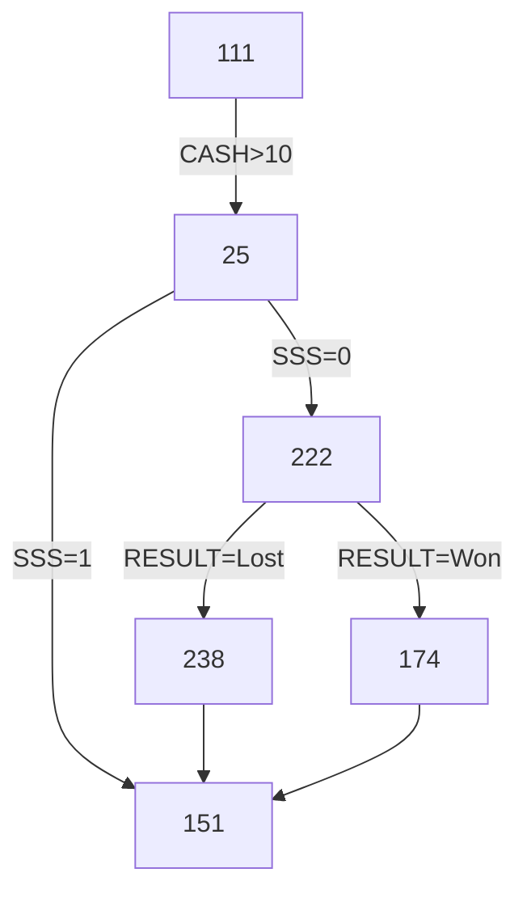

<!--suppress ALL -->

<p align="center">
    <a href="https://www.ninergames.com/" target="_blank">
        
    </a>
</p>

<p align="center">
    
</p>

<hr>

# Installation

## Base Installation

Clone repository:

```bash
git clone git@github.com:niner-games/magiedit.com.git magiedit
cd magiedit
```

Install PHP dependencies

```bash
composer install
```

_Use `--no-dev` flag if you do not intend to contribute to the project._

## Environment Configuration

* Create a MySQL database. Do not create any tables.

* Create the `.env` file in the project root and update the database credentials:

```env
DB_CONNECTION=mysql
DB_HOST=127.0.0.0
DB_PORT=3306
DB_DATABASE=magiedit
DB_USERNAME=root
DB_PASSWORD=
```

Run commands:

- `php artisan migrate`
- `php artisan key:generate`

Change other settings in `.env` as needed:

```env
APP_URL=http://magiedit.test
APP_ENV=local
APP_DEBUG=true
```

Configure mail transport:

```env
MAIL_MAILER=smtp
MAIL_HOST=web5.aftermarket.hosting
MAIL_PORT=587
MAIL_USERNAME=hello@magiedit.com
MAIL_PASSWORD=
MAIL_ENCRYPTION=tls
MAIL_FROM_ADDRESS="hello@magiedit.com"
MAIL_FROM_NAME="${APP_NAME}"
```

## Git Hook

_If you do not intend to contribute to the project, you can skip this step._

In the root directory, navigate to the hidden `.git/hooks/` folder. Create a file there called `pre-commit` and paste the following contents into it:

```bash
#!/bin/sh
echo "Running npm run build before commit..."
npm run build
git add public/build
```

_Git, before committing (from any source; PhpStorm, Git for Windows, etc.), will make sure that your current commit **contains all actual artifacts from Vite**, by running `npm run build` prior to committing._

# Releases

1. Make a tag:
    * For latest commit: `git tag -a 1.4 -m "New release"`
    * For exiting commit:
        * List all commits: `git log --pretty=oneline`
        * Pick the one you wish to tag (first seven letters are enough)
        * Add a tag: `git tag -a 0.1 32c274c -m "First version"`
    * Please, **do not** use `v1.0` scheme; no need to prepend with `v`
    * Use [Semantic Versioning 2.0.0](https://semver.org/) (three numbers) whenever possible
2. Push tag(s) to GitHub: `git push --tags` (pushes tags **only**!)
3. Create [a new release](https://github.com/akademia-slaska/template-repository/releases/new):
    * pick a tag
    * add title and a description
    * add some binaries, set options, etc.
4. Publish a release or save it as a draft.

Remember that GitHub **always adds a source code** to release.

# Tools

1. To **generate a password** or a key, [RandomKeygen](https://randomkeygen.com/) generator simply rocks!

2. We can setup a quick 1-to-1 **screen sharing session** using jitbit.com free [browser screen sharing tool](https://www.jitbit.com/screensharing/).

3. When a quick **on-line Markdown editor** is needed, you can give [StackEdit](https://stackedit.io/app#) a try.

4. For **converting text files** from one markup format to another, [pandoc](https://pandoc.org/index.html) is your swiss-army knife.

# Diagrams

If diagrams are needed, we can use [MermaidJS tool for JavaScript](https://mermaid.js.org/) across entire GitHub (in issues, wikis, discussions and in regular text files. GitHub support for MermaidJS causes that you can just write something like this:

	```
	flowchart TD
	    111 --> |CASH > 10| 25
	    25 --> |SSS = 1| 151
	    25 --> |SSS = 0| 222
	    222 --> |RESULT = Won| 174
	    222 --> |RESULT = Lost| 238    
	    238 --> 151
	    174 --> 151
	    click 174 href "https://mermaid.live/edit
	```

And you'll end up with something like this:



You can use:

- [Mermaid  Live Editor](https://mermaid.live/) to view rendered MermaidJS code as you type it or
- [mermaid.ink Generator](https://mermaid.ink/) to convert (render) MermaidJS code it into an image or data-uri string.

An alternative to the above *Flow Chart Diagram* is [State Machine Diagram](https://mermaid.live/edit#pako:eNpdjz0LgzAQhv-K3Fh06ejQpV2d3No4HObUQD4kXoQi_vemCdJipofn3gv3btA7SVDDwsj0UDh6NNV6FbaI73Xpiqq6FS0rrbNKmGQcnlXjVmXHbDOf1__s3eMyZZvw-BRKMOQNKhnP2r4BATyRIQF1REkDBs0ChN1jFAO79m17qNkHKiHM8lfkkCQVO9_kpqlwCTPap3MxMqBeaP8ArztTOA). It renders quite similar diagrams.

MermaidJS supports other diagram types. Including: [Class Diagram](https://mermaid.live/edit#pako:eNptkc9OwzAMxl8l8glE-wIVF8SYxGGn3aZKyE28LmrijPzRBGPvTlrWMDZySfyzP-uLfQTpFEED0mAIC429R9uyyOeJtUUjHr_qWiySHG7pUofdLd1Q5_EPbsSD5iiwp2u8jl5zL3piRf4yOUrCCm1-3t1fJSxGmuFke7J3_AGiNO0Ih2dnnC-JcNB2FubwPaEc5vh02W_8WOlXj96D_qRXXhLFgiXyC8Z_9dMIfg11zhmhw9tBG1WgT1y0UIElb1GrvIlJ10LckaUWmvxUtMVkYgstj6WYolt_sIQm-kQVpL3KEznvboakdHR-dV7ueFWwR944l0u2aAKdvgFIMZyC), [Sequence Diagram](https://mermaid.live/edit#pako:eNptkLFqAzEMhl9F0VrfC9yQUujQFDp1K16E_V_OYFuJY1NCyLvXd9ds0fQjfZ9AurFTDx75gnNDdngPciySbKZebzE4DPv9y6fOeaQPxKi0ZEOz_pIU0FXb61N4w5zkBaEZUijhH11mQ0eH1emLw2YbOqzGSndt9xw_0AREOhZI3bHhhJIk-H7FbREs1xkJlscePSZpsVq2-d5RaVW_r9nxWEuD4XbyUh9HP5rwoWr52h6z_sfwSfKPakcmiRfc_wC26mTi) and [Entity Relation Diagram](https://mermaid.live/edit#pako:eNp10VFrgzAQB_CvEu5Z-wF8KxqGMOeIttCRl8ycbUCNpLEw1O--WA1bO5a3HL_7J9yNUGmJEAGaRImzES3viDvxoSjzjDIyT7vdNJKEvqZHyk7hPkkYLQoSkYu4PtlpCkM9kpwl7hKRvhEV_mPSt2OextQpDo0Snw2SWhsOq_7z2lOywQrVzWf7rAVNP6jSNzQbWWu_QZiWNHNKdVUzSB_1zvLkEJdhvC_pS85OvmWr31M7K1T36B_-55M5aCPRoHRvcIAAWjStUNINe1y6OdgLtshhoRJrMTR2GcDsqBisLr66CiJrBgxg6KWwuG3IF1Eqq0227u--xgB60X1o7UgtmivO35Pxk64).

# License

MagiEdit is open-sourced software licensed under the [MIT license](https://opensource.org/licenses/MIT).
